## What is Multi-Tenant?

A multi-tenant MCP server is **one canister** that serves **many users**, where each user's data is segregated by their principal ID.

```mermaid
flowchart TD
    UA["👤 User A"]
    UB["👤 User B"]
    UC["👤 User C"]

    subgraph Shared["📦 Shared Canister"]
        direction TB
        DA["User A Todos"]
        DB["User B Todos"]
        DC["User C Todos"]
    end

    UA ==> Shared
    UB ==> Shared
    UC ==> Shared

    style UA fill:#4a90e2,stroke:#2d3748,stroke-width:2px,color:#fff
    style UB fill:#4a90e2,stroke:#2d3748,stroke-width:2px,color:#fff
    style UC fill:#4a90e2,stroke:#2d3748,stroke-width:2px,color:#fff
    style Shared fill:#48bb78,stroke:#2d3748,stroke-width:2px,color:#fff
    style DA fill:#4a5568,stroke:#718096,stroke-width:1px,color:#fff
    style DB fill:#4a5568,stroke:#718096,stroke-width:1px,color:#fff
    style DC fill:#4a5568,stroke:#718096,stroke-width:1px,color:#fff
```



**When to Use:**

- ✅ Todo/task lists, notes, calendars, settings
- ❌ Token custody, financial operations, per-user contracts

**Trade-offs:**

- **Pros:** Cost-effective, simple deployment, shared resources
- **Cons:** Shared storage limits, requires careful access control

---

## Example: Multi-Tenant Todo List

Let's build a simple todo list MCP where each user has their own isolated tasks.

### 1. Define Your Data Model

```motoko
// src/Types.mo
module {
  public type Todo = {
    id: Text;
    title: Text;
    completed: Bool;
    createdAt: Int;
  };

  public type UserData = {
    todos: [Todo];
    createdAt: Int;
  };
};
```

### 2. Set Up Principal-Based Storage

```motoko
// src/main.mo
import Map "mo:map/Map";
import { phash } "mo:map/Map";
import Principal "mo:base/Principal";
import Time "mo:base/Time";
import Array "mo:base/Array";

actor TodoMCP {
  // Store each user's data by their principal
  stable var userData = Map.new<Principal, Types.UserData>();

  // Helper to get or create user data
  private func getUserData(caller: Principal) : Types.UserData {
    switch (Map.get(userData, phash, caller)) {
      case (?data) data;
      case (null) {
        let newData: Types.UserData = {
          todos = [];
          createdAt = Time.now();
        };
        Map.set(userData, phash, caller, newData);
        newData
      };
    };
  };

  // Helper to update user data
  private func setUserData(caller: Principal, data: Types.UserData) {
    Map.set(userData, phash, caller, data);
  };
}
```

### 3. Create MCP Tools

```motoko
// Tool 1: Add Todo
public func todo_add(title: Text, auth: ?AuthTypes.AuthInfo) : async Result.Result<Text, Text> {
  // Get authenticated user's principal
  let caller = switch (auth) {
    case (?authInfo) authInfo.principal;
    case (null) { return #err("Authentication required") };
  };

  // Get user's data (creates if new user)
  var data = getUserData(caller);

  // Create new todo
  let newTodo: Types.Todo = {
    id = Principal.toText(caller) # "-" # Int.toText(Time.now());
    title = title;
    completed = false;
    createdAt = Time.now();
  };

  // Add to user's todos
  data := {
    data with
    todos = Array.append(data.todos, [newTodo]);
  };

  // Save updated data
  setUserData(caller, data);

  #ok(newTodo.id)
};

// Tool 2: List Todos
public func todo_list(auth: ?AuthTypes.AuthInfo) : async Result.Result<[Types.Todo], Text> {
  let caller = switch (auth) {
    case (?authInfo) authInfo.principal;
    case (null) { return #err("Authentication required") };
  };

  let data = getUserData(caller);
  #ok(data.todos)
};

// Tool 3: Toggle Todo
public func todo_toggle(id: Text, auth: ?AuthTypes.AuthInfo) : async Result.Result<(), Text> {
  let caller = switch (auth) {
    case (?authInfo) authInfo.principal;
    case (null) { return #err("Authentication required") };
  };

  var data = getUserData(caller);

  // Find and toggle the todo
  let updatedTodos = Array.map<Types.Todo, Types.Todo>(
    data.todos,
    func(todo) {
      if (todo.id == id) {
        { todo with completed = not todo.completed }
      } else {
        todo
      }
    }
  );

  data := { data with todos = updatedTodos };
  setUserData(caller, data);

  #ok()
};

// Tool 4: Delete Todo
public func todo_delete(id: Text, auth: ?AuthTypes.AuthInfo) : async Result.Result<(), Text> {
  let caller = switch (auth) {
    case (?authInfo) authInfo.principal;
    case (null) { return #err("Authentication required") };
  };

  var data = getUserData(caller);

  // Remove the todo
  let filteredTodos = Array.filter<Types.Todo>(
    data.todos,
    func(todo) { todo.id != id }
  );

  data := { data with todos = filteredTodos };
  setUserData(caller, data);

  #ok()
};
```

### 4. Register with MCP Server

```motoko
import Mcp "mo:mcp-motoko-sdk/mcp/Mcp";
import McpTypes "mo:mcp-motoko-sdk/mcp/Types";

// Define tool schemas
let todoAddTool: McpTypes.Tool = {
  name = "todo_add";
  title = ?"Add Todo";
  description = ?"Create a new todo item in your personal list";
  payment = null;
  inputSchema = Json.obj([
    ("type", Json.str("object")),
    ("properties", Json.obj([
      ("title", Json.obj([
        ("type", Json.str("string")),
        ("description", Json.str("Todo title"))
      ]))
    ])),
    ("required", Json.arr([Json.str("title")]))
  ]);
  outputSchema = ?Json.obj([
    ("type", Json.str("object")),
    ("properties", Json.obj([
      ("id", Json.obj([("type", Json.str("string"))]))
    ]))
  ]);
};

// Register all tools
let mcpConfig: McpTypes.McpConfig = {
  self = Principal.fromActor(self);
  serverInfo = {
    name = "io.example.todo";
    title = "Multi-Tenant Todo List";
    version = "1.0.0";
  };
  tools = [todoAddTool, todoListTool, todoToggleTool, todoDeleteTool];
  toolImplementations = [
    ("todo_add", handleTodoAdd),
    ("todo_list", handleTodoList),
    ("todo_toggle", handleTodoToggle),
    ("todo_delete", handleTodoDelete)
  ];
  // ... other MCP config
};

let mcpServer = Mcp.createServer(mcpConfig);
```

---

## Key Security Principles

### 1. Always Check the Caller

```motoko
// ✅ CORRECT - Each user only accesses their own data
let caller = switch (auth) {
  case (?authInfo) authInfo.principal;
  case (null) { return #err("Authentication required") };
};
let data = getUserData(caller); // Automatically scoped to this user

// ❌ WRONG - Never search across all users
for ((principal, data) in userData.entries()) {
  // This can leak data from other users!
}
```

### 2. No Cross-User Access

```motoko
// ❌ NEVER allow accessing another user's data
public func get_user_todos(userId: Text) : async [Types.Todo] {
  // This is dangerous! Any user could access anyone's data
}

// ✅ ALWAYS use the authenticated principal
public func get_my_todos(auth: ?AuthTypes.AuthInfo) : async [Types.Todo] {
  let caller = switch (auth) {
    case (?authInfo) authInfo.principal;
    case (null) { return #err("Authentication required") };
  };
  let data = getUserData(caller);
  data.todos
}
```

### 3. Validate All Inputs

```motoko
// Check title length
if (title.size() == 0) {
  return #err("Title cannot be empty");
};
if (title.size() > 500) {
  return #err("Title too long (max 500 characters)");
};
```

---

## Testing Your Multi-Tenant App

### 1. Deploy Locally

```bash
dfx start --background
dfx deploy
```

### 2. Create API Keys for Different Users

```bash
# User 1
dfx identity use alice
dfx canister call todo_mcp create_my_api_key '("Test Key", vec {})'
# Save the key: KEY_ALICE="..."

# User 2
dfx identity use bob
dfx canister call todo_mcp create_my_api_key '("Test Key", vec {})'
# Save the key: KEY_BOB="..."
```
