## Overview

This repository demonstrates a pattern for creating MCP server canisters that act as secure, identity-owning "wrappers" around existing Internet Computer backend canisters. The MCP server exposes high-level tools (API endpoints) for AI agents, handling:

- **Authentication & Authorization**: API keys or OAuth for secure access
- **Identity Management**: The canister acts as an identity that can hold allowances and execute transactions
- **Workflow Orchestration**: Multi-step operations (e.g., check balance → pull funds → approve → execute swap)
- **Error Handling**: Graceful error recovery and user-friendly messages
- **State Management**: Tracking operations and maintaining context

---

## What is This Pattern?

### The Problem

AI agents need to interact with on-chain applications, but directly exposing low-level canister methods has several challenges:

1. **Complexity**: Multi-step workflows require multiple calls and state management
2. **Security**: Agents need controlled, scoped access to user funds
3. **Identity**: Agents need a persistent identity to hold temporary allowances
4. **UX**: Agents benefit from high-level, semantic operations rather than raw blockchain calls

### The Solution

Create an MCP server canister that:

- **Wraps** your existing backend logic
- **Exposes** high-level tools for common operations
- **Manages** its own identity and can receive allowances
- **Orchestrates** complex multi-step workflows
- **Enforces** security through authentication and authorization

---

## Key Components

### 1. Your Backend Canister

Your existing business logic (e.g., `KongSwap.mo` - a DEX canister). This remains unchanged and continues to provide its core functionality.

### 2. MCP Server Canister (`src/main.mo`)

The main actor that:

- Imports the MCP Motoko SDK
- Registers tools and resources
- Handles HTTP requests
- Manages authentication
- Provides lifecycle management

### 3. Tool Modules (`src/tools/*.mo`)

Individual modules that implement high-level operations:

- Parse and validate inputs
- Check authorization
- Execute multi-step workflows
- Return structured results

### 4. Tool Context (`src/tools/ToolContext.mo`)

A shared context object that provides tools with:

- Canister principal (identity)
- Owner principal
- Backend canister IDs
- Shared configuration

### 5. Type Declarations (`src/declarations/`)

Generated TypeScript/JavaScript bindings for:

- Frontend integration
- Agent SDKs
- Testing tools

---

## Architecture

```mermaid
graph TB
    Agent["AI Agent<br/>(Claude, GPT, Custom)"]
    Agent -->|MCP Protocol<br/>HTTP/JSON-RPC| MCP

    subgraph MCP["MCP Server Canister"]
        Auth["Authentication Layer<br/>• API Keys • OAuth • Scope Validation"]
        Tools["Tool Handler Layer<br/>• dex_swap_submit • dex_quote • dex_claim"]
        Orch["Orchestration Layer<br/>• Parse inputs • Check balances<br/>• Pull funds • Approve spenders<br/>• Execute calls • Return results"]

        Auth --> Tools
        Tools --> Orch
    end

    MCP -->|Candid Interface| Backend["Your Backend Canister(s)<br/>(KongSwap, ICRC Ledgers, Custom Logic)"]

    style Agent fill:#4a90e2
    style MCP fill:#2d3748
    style Auth fill:#48bb78
    style Tools fill:#ed8936
    style Orch fill:#9f7aea
    style Backend fill:#38b2ac
```



---

## Step-by-Step: Wrap Your Own Canister

### Step 1: Set Up Your Project

#### Option A: Clone This Repository

```bash
git clone https://github.com/jneums/arcswap.git my-wrapper
cd my-wrapper
```

#### Option B: Start Fresh

```bash
npx create-motoko-mcp-server my-wrapper
cd my-wrapper
```

### Step 2: Install Dependencies

```bash
npm install
npm run mops:install
```

### Step 3: Import Your Backend

If your backend is a Motoko canister, you can import it directly or generate bindings:

```motoko
// src/MyBackend.mo
// Either copy your backend code here, or create bindings:

module {
  public type Self = actor {
    // Your methods here
    my_method : shared (Text) -> async Result.Result<Text, Text>;
  };
};
```

Or use the `ic` import if your backend is already deployed:

```motoko
import MyBackend "ic:my-backend-canister-id";
```

### Step 4: Create Your Tool Context

Edit `src/tools/ToolContext.mo` to include your configuration:

```motoko
module ToolContext {
  public type ToolContext = {
    canisterPrincipal : Principal;
    owner : Principal;

    // Add your backend canister IDs
    myBackendCanisterId : Principal;

    // Add any other shared state
    maxTransactionSize : Nat;
    allowedTokens : [Text];
  };

  // Helper functions for common auth checks
  public func checkOwnerAuth(
    context : ToolContext,
    auth : ?AuthTypes.AuthInfo
  ) : Result.Result<(), Text> {
    switch (auth) {
      case (null) { #err("Authentication required") };
      case (?authInfo) {
        if (Principal.equal(authInfo.principal, context.owner)) {
          #ok(());
        } else {
          #err("Unauthorized: Only owner can perform this action");
        };
      };
    };
  };
};
```

### Step 5: Create Tool Modules

Create a new file for each high-level operation in `src/tools/`:

```motoko
// src/tools/my_operation.mo
import McpTypes "mo:mcp-motoko-sdk/mcp/Types";
import AuthTypes "mo:mcp-motoko-sdk/auth/Types";
import Result "mo:base/Result";
import Principal "mo:base/Principal";
import Json "mo:json";

import ToolContext "ToolContext";
import MyBackend "../MyBackend";

module {
  // Define the tool schema (what the AI agent sees)
  public func config() : McpTypes.Tool = {
    name = "my_operation";
    title = ?"Execute My Operation";
    description = ?(
      "Performs a high-level operation that orchestrates " #
      "multiple backend calls on behalf of the user."
    );
    payment = null; // or set payment requirements
    inputSchema = Json.obj([
      ("type", Json.str("object")),
      ("properties", Json.obj([
        ("param1", Json.obj([
          ("type", Json.str("string")),
          ("description", Json.str("Description of param1"))
        ])),
        ("param2", Json.obj([
          ("type", Json.str("string")),
          ("description", Json.str("Description of param2"))
        ]))
      ])),
      ("required", Json.arr([
        Json.str("param1"),
        Json.str("param2")
      ]))
    ]);
    outputSchema = ?Json.obj([
      ("type", Json.str("object")),
      ("properties", Json.obj([
        ("result", Json.obj([
          ("type", Json.str("string"))
        ])),
        ("status", Json.obj([
          ("type", Json.str("string"))
        ]))
      ]))
    ]);
  };

  // Implement the tool handler
  public func handle(
    context : ToolContext.ToolContext
  ) : (
    _args : McpTypes.JsonValue,
    _auth : ?AuthTypes.AuthInfo,
    cb : (Result.Result<McpTypes.CallToolResult, McpTypes.HandlerError>) -> ()
  ) -> async () {

    func(
      _args : McpTypes.JsonValue,
      _auth : ?AuthTypes.AuthInfo,
      cb : (Result.Result<McpTypes.CallToolResult, McpTypes.HandlerError>) -> ()
    ) : async () {

      // Helper functions
      func makeError(message : Text) {
        cb(#ok({
          content = [#text({ text = message })];
          isError = true;
          structuredContent = null
        }));
      };

      func ok(structured : Json.Json) {
        cb(#ok({
          content = [#text({ text = Json.stringify(structured, null) })];
          isError = false;
          structuredContent = ?structured
        }));
      };

      // Check authorization
      switch (ToolContext.checkOwnerAuth(context, _auth)) {
        case (#err(msg)) { return makeError(msg) };
        case (#ok()) {};
      };

      // Parse inputs
      let param1 = switch (Json.getAsText(_args, "param1")) {
        case (#ok t) t;
        case _ { return makeError("Missing 'param1'") };
      };

      let param2 = switch (Json.getAsText(_args, "param2")) {
        case (#ok t) t;
        case _ { return makeError("Missing 'param2'") };
      };

      // Execute your backend logic
      let backend = actor(
        Principal.toText(context.myBackendCanisterId)
      ) : MyBackend.Self;

      try {
        // Step 1: Do something
        // Step 2: Do something else
        // Step 3: Return results

        let result = await backend.my_method(param1);

        switch (result) {
          case (#Ok(value)) {
            let output = Json.obj([
              ("result", Json.str(value)),
              ("status", Json.str("success"))
            ]);
            ok(output);
          };
          case (#Err(err)) {
            makeError("Operation failed: " # err);
          };
        };
      } catch (e) {
        makeError("Unexpected error: " # Error.message(e));
      };
    };
  };
};
```

### Step 6: Register Tools in Main Actor

Edit `src/main.mo` to register your tools:

```motoko
import my_operation "tools/my_operation";

// ... inside the actor ...

// Initialize your tool context
transient let toolContext : ToolContext.ToolContext = {
  canisterPrincipal = Principal.fromActor(self);
  owner = owner;
  myBackendCanisterId = Principal.fromText("your-backend-canister-id");
  maxTransactionSize = 1_000_000;
  allowedTokens = ["ICP", "ckBTC"];
};

// Register tools
transient let tools : [McpTypes.Tool] = [
  my_operation.config(),
  // Add more tools here
];

// Configure MCP
transient let mcpConfig : McpTypes.McpConfig = {
  self = Principal.fromActor(self);
  allowanceUrl = ?allowanceUrl;
  serverInfo = {
    name = "io.example.my-wrapper";
    title = "My Wrapper";
    version = "0.1.0";
  };
  resources = resources;
  resourceReader = func(uri) { null };
  tools = tools;
  toolImplementations = [
    ("my_operation", my_operation.handle(toolContext)),
    // Add more implementations here
  ];
  beacon = beaconContext;
};
```

### Step 7: Configure Authentication

Choose your authentication strategy in `src/main.mo`:

#### Option A: No Authentication (Public Tools)

```motoko
transient let authContext : ?AuthTypes.AuthContext = null;
```

#### Option B: API Keys Only

```motoko
let issuerUrl = "https://your-issuer.icp0.io";
let allowanceUrl = "https://prometheusprotocol.org/app/your-namespace";
let requiredScopes = ["openid"];

transient let authContext : ?AuthTypes.AuthContext = ?AuthState.init(
  Principal.fromActor(self),
  owner,
  issuerUrl,
  requiredScopes,
  transformJwksResponse,
);
```

### Step 8: Update Project Configuration

Edit `dfx.json`:

```json
{
  "canisters": {
    "my_wrapper": {
      "main": "src/main.mo",
      "type": "motoko"
    }
  },
  "defaults": {
    "build": {
      "packtool": "mops sources"
    }
  }
}
```

Edit `mops.toml`:

```toml
[package]
name = "my-wrapper"
version = "1.0.0"
description = "MCP server wrapper for my backend"
```

Edit `prometheus.yml` (for app store submission):

```yaml
namespace: io.example.my-wrapper

submission:
  name: My Wrapper
  description: AI agent interface for my backend canister
  publisher: Your Name/Org
  category: Utilities
  deployment_type: provisioned
  # ... rest of the config
```

---

## Example: ArcSwap Wrapping KongSwap

This repository demonstrates wrapping the KongSwap DEX. Let's examine the key components:

### Backend Integration

```motoko
// src/KongSwap.mo
// Generated bindings for the KongSwap DEX canister
module {
  public type Self = actor {
    swap : shared SwapArgs -> async SwapResult;
    swap_amounts : shared query (Text, Nat, Text) -> async SwapAmountsResult;
    // ... other methods
  };
};
```

### Tool Context

```motoko
// src/tools/ToolContext.mo
public type ToolContext = {
  canisterPrincipal : Principal;  // This canister's identity
  owner : Principal;               // The authorized user
  dexCanisterId : Principal;       // KongSwap canister ID
};
```

### Tool Implementation: DEX Swap Submit

The `dex_swap_submit` tool orchestrates a complex workflow:

1. **Check authorization** - Verify the caller is the owner
2. **Check balance** - See if the canister already has enough tokens
3. **Pull funds (if needed)** - Use ICRC-2 `transfer_from` to pull from user's wallet
4. **Approve DEX** - Grant the DEX an allowance to spend tokens
5. **Get quote** - Query the DEX for expected output
6. **Execute swap** - Submit the swap transaction
7. **Return results** - Send structured output back to the agent

```motoko
// src/tools/dex_swap_submit.mo
public func handle(context : ToolContext.ToolContext) : (...) -> async () {
  func(...) : async () {
    // 1. Authorize
    if (userWalletPrincipal != context.owner) {
      return makeError("Unauthorized");
    };

    // 2. Check balance
    let currentBalance = await ledger.icrc1_balance_of({...});

    // 3. Pull funds if needed
    if (currentBalance < totalAmountRequired) {
      let amountToPull = totalAmountRequired - currentBalance;
      // ... pull via transfer_from
    };

    // 4. Approve DEX
    switch (await ledger.icrc2_approve(approveArgs)) {
      case (#Ok(_)) {};
      case (#Err(err)) { return makeError("Approve failed") };
    };

    // 5. Get quote
    let quote = await dex.swap_amounts(...);

    // 6. Execute swap
    let swapRes = await dex.swap(swapArgs);

    // 7. Return results
    ok(Json.obj([...]));
  };
};
```

This single tool call from an AI agent triggers all these steps automatically!

---

## Tool Module Structure

Every tool module should follow this structure:

### 1. Configuration Function

Defines the tool's schema for AI agents:

```motoko
public func config() : McpTypes.Tool = {
  name = "tool_name";
  title = ?"Human Readable Title";
  description = ?"Detailed description of what this tool does";
  payment = null; // or payment config
  inputSchema = Json.obj([...]); // JSON Schema for inputs
  outputSchema = ?Json.obj([...]); // JSON Schema for outputs
};
```

### 2. Handler Function

Implements the actual logic:

```motoko
public func handle(context : ToolContext.ToolContext) : Handler {
  func(_args, _auth, cb) : async () {
    // 1. Validate auth
    // 2. Parse inputs
    // 3. Execute logic
    // 4. Return results via callback
  };
};
```

### 3. Input Validation

Always validate and sanitize inputs:

```motoko
let param = switch (Json.getAsText(_args, "param")) {
  case (#ok t) t;
  case _ { return makeError("Missing 'param'") };
};

let amount = switch (Json.getAsText(_args, "amount")) {
  case (#ok s) {
    switch (Nat.fromText(s)) {
      case (?n) n;
      case null { return makeError("Invalid 'amount'") };
    };
  };
  case _ { return makeError("Missing 'amount'") };
};
```

### 4. Error Handling

Provide clear, actionable error messages:

```motoko
func makeError(message : Text) {
  cb(#ok({
    content = [#text({ text = message })];
    isError = true;
    structuredContent = null
  }));
};

// Use try-catch for async calls
try {
  let result = await backend.method();
} catch (e) {
  makeError("Operation failed: " # Error.message(e));
};
```

### 5. Structured Output

Return JSON for easy parsing:

```motoko
func ok(structured : Json.Json) {
  cb(#ok({
    content = [#text({ text = Json.stringify(structured, null) })];
    isError = false;
    structuredContent = ?structured
  }));
};

// Success response
let output = Json.obj([
  ("status", Json.str("success")),
  ("result", Json.str("Result value")),
  ("transaction_id", Json.str("123456"))
]);
ok(output);
```

---

## Authentication & Authorization

### API Key Authentication

Enable API keys for simple authentication:

```motoko
// In main.mo
transient let authContext : ?AuthTypes.AuthContext = ?AuthState.init(...);

// Create API keys
public shared (msg) func create_my_api_key(
  name : Text,
  scopes : [Text]
) : async Text {
  return await ApiKey.create_my_api_key(ctx, msg.caller, name, scopes);
};

// In your tool
switch (_auth) {
  case (?authInfo) {
    // authInfo.principal is the authenticated user
    // authInfo.scopes contains granted scopes
  };
  case (null) {
    return makeError("Authentication required");
  };
};
```

### Owner-Only Operations

Restrict sensitive operations to the canister owner:

```motoko
if (userWalletPrincipal != context.owner) {
  return makeError("Unauthorized: Only owner can perform this action");
};
```

### Scope-Based Access

Check for specific scopes:

```motoko
switch (_auth) {
  case (?authInfo) {
    if (not Array.contains("write:swaps", authInfo.scopes, Text.equal)) {
      return makeError("Insufficient permissions");
    };
  };
  case (null) {
    return makeError("Authentication required");
  };
};
```

---

## Security Best Practices

### 1. Never Store User Funds Long-Term

The canister should only hold funds temporarily during execution:

```motoko
// ✅ Good: Pull → Approve → Execute → Funds go to user
let result = await ledger.icrc2_transfer_from(...);
let approved = await ledger.icrc2_approve(...);
let swap = await dex.swap(...);

// ❌ Bad: Storing user funds indefinitely
// Don't keep balances in stable variables
```

### 2. Validate All Inputs

```motoko
// Check principal format
let principal = switch (Principal.fromText(input)) {
  case (p) p;
  case (_) { return makeError("Invalid principal") };
};

// Check numeric ranges
if (amount < minAmount or amount > maxAmount) {
  return makeError("Amount out of range");
};

// Validate against allowlists
if (not Array.contains(token, allowedTokens, Text.equal)) {
  return makeError("Token not allowed");
};
```

### 3. Use Allowances, Not Direct Transfers

```motoko
// ✅ Good: User grants allowance, canister pulls exact amount
let allowance = await ledger.icrc2_allowance({...});
if (allowance.allowance < required) {
  return makeError("Insufficient allowance");
};
await ledger.icrc2_transfer_from({...});

// ❌ Bad: Asking user to send funds to canister first
```

### 4. Implement Rate Limiting

```motoko
// Track operations per user
var operationCounts = Map.new<Principal, (Nat, Time.Time)>();

// Check rate limit
switch (Map.get(operationCounts, caller)) {
  case (?(count, timestamp)) {
    if (Time.now() - timestamp < rateLimitWindow) {
      if (count >= maxOperationsPerWindow) {
        return makeError("Rate limit exceeded");
      };
    };
  };
  case (null) {};
};
```

### 5. Add Timeouts and Expiry

```motoko
// Quote expiry
let expiresAt = Time.now() + (5 * 60 * 1_000_000_000); // 5 minutes

// Check expiry before executing
if (Time.now() > quoteExpiresAt) {
  return makeError("Quote expired, please request a new quote");
};
```

### 6. Audit Logging

```motoko
// Log critical operations
Debug.print("Swap executed: user=" # Principal.toText(user) #
            " amount=" # Nat.toText(amount) #
            " tx_id=" # Nat.toText(txId));
```

---

## Testing Your MCP Server

### Local Development

```bash
# Start local replica
npm run start

# Deploy canister
npm run deploy

# Get canister ID
dfx canister id my_wrapper
```

### Create API Key

```bash
# Create an API key for testing
dfx canister call $(dfx canister id my_wrapper) \
  create_my_api_key '("Test Key", vec {})'

# Save the returned key - you'll need it for authentication
```

### Test with MCP Inspector

```bash
# Launch MCP Inspector
npm run inspector
```

In the inspector:

1. Connect to: `http://localhost:4943/mcp?canister=<CANISTER_ID>`
2. Add authentication header: `x-api-key: <YOUR_API_KEY>`
3. Browse available tools
4. Test tool calls with sample inputs

### Unit Testing

Create test files in `test/`:

```motoko
// test/test_my_operation.mo
import Debug "mo:base/Debug";
import Principal "mo:base/Principal";
import MyOperation "../src/tools/my_operation";

actor {
  public func run() : async () {
    Debug.print("Testing my_operation...");

    let config = MyOperation.config();
    assert(config.name == "my_operation");

    Debug.print("✓ All tests passed");
  };
};
```

---

## Deployment

### Local Deployment

```bash
dfx start --background
dfx deploy
```

### Mainnet Deployment

```bash
# Deploy to mainnet
dfx deploy --network ic

# Set production owner
dfx canister call my_wrapper set_owner \
  '(principal "your-production-principal")' \
  --network ic

# Create production API keys
dfx canister call my_wrapper create_my_api_key \
  '("Production Key", vec {})' \
  --network ic
```

### Configure Frontend

Update your frontend to connect to the deployed canister:

```javascript
import { createActor } from './declarations/my_wrapper';

const canisterId = process.env.CANISTER_ID_MY_WRAPPER;
const actor = createActor(canisterId, {
  agentOptions: {
    host: 'https://ic0.app',
  },
});
```

---

## Advanced Patterns

### Multi-Canister Orchestration

Your wrapper can coordinate across multiple backend canisters:

```motoko
public type ToolContext = {
  canisterPrincipal : Principal;
  owner : Principal;
  dexCanisterId : Principal;
  nftMarketplaceId : Principal;
  governanceCanisterId : Principal;
};

// In your tool
let dex = actor(Principal.toText(context.dexCanisterId)) : DEX.Self;
let marketplace = actor(Principal.toText(context.nftMarketplaceId)) : NFT.Self;

// Orchestrate across both
let swapResult = await dex.swap(...);
let nftPurchase = await marketplace.buy(...);
```

### State Machines for Complex Workflows

```motoko
type WorkflowState = {
  #Initialized;
  #FundsPulled;
  #Approved;
  #Executed;
  #Completed;
  #Failed : Text;
};

var workflows = Map.new<Nat, WorkflowState>();

// Track and resume workflows
public func resume_workflow(id : Nat) : async Result<(), Text> {
  switch (Map.get(workflows, id)) {
    case (?(#FundsPulled)) {
      // Continue from approval step
    };
    case (_) {
      #err("Cannot resume workflow in this state");
    };
  };
};
```

### Batching Operations

```motoko
public func batch_operations(
  operations : [Operation]
) : async [Result<Output, Text>] {
  let results = Array.init<Result<Output, Text>>(
    operations.size(),
    #err("Not executed")
  );

  for (i in operations.keys()) {
    results[i] := await execute_operation(operations[i]);
  };

  return Array.freeze(results);
};
```

---

## References

### Documentation

- [Model Context Protocol (MCP)](https://github.com/prometheusprotocol/model-context-protocol)
- [MCP Motoko SDK](https://github.com/prometheusprotocol/mcp-motoko-sdk)
- [DFINITY Motoko Documentation](https://internetcomputer.org/docs/current/developer-docs/backend/motoko/)
- [Internet Computer Developer Docs](https://internetcomputer.org/docs)

### Standards

- [ICRC-1: Fungible Token Standard](https://github.com/dfinity/ICRC-1)
- [ICRC-2: Approve and Transfer From](https://github.com/dfinity/ICRC-1/tree/main/standards/ICRC-2)
- [ICRC-21: Canister Call Consent Messages](https://github.com/dfinity/ICRC/blob/main/ICRCs/ICRC-21/ICRC-21.md)

### Tools

- [DFX - Canister SDK](https://github.com/dfinity/sdk)
- [MOPS - Motoko Package Manager](https://mops.one)
- [MCP Inspector](https://github.com/modelcontextprotocol/inspector)
- [Prometheus Protocol](https://prometheusprotocol.org)

### Example Projects

- [ArcSwap (This Repo)](https://github.com/jneums/arcswap) - DEX wrapper
- [Synapse Fund](https://github.com/jneums/synapse-fund) - Portfolio management wrapper

---

## Community & Support

- **Prometheus Protocol Discord**: [Join](https://discord.gg/prometheusprotocol)
- **DFINITY Forum**: [forum.dfinity.org](https://forum.dfinity.org)
- **GitHub Issues**: Report bugs or request features in this repo

---

## License

This guide and the ArcSwap example are licensed under the MIT License. See LICENSE file for details.

---

## Contributing

Contributions are welcome! Please:

1. Fork the repository
2. Create a feature branch
3. Make your changes
4. Add tests
5. Submit a pull request

---

## Changelog

### v0.1.0 (Initial Release)

- Basic wrapper pattern
- DEX swap orchestration
- API key authentication
- MCP Inspector integration

---

**Happy Building! 🚀**

If you create a wrapper using this pattern, we'd love to hear about it. Share your project on the Prometheus Protocol Discord or tag @prometheusprotocol on X (Twitter).
