# Wrapper Pattern Guide

Build an MCP canister that wraps existing backend logic, providing AI agents with high-level tools and identity management.

## What is the Wrapper Pattern?

The wrapper pattern creates an **MCP server canister** that acts as an identity-owning interface to your existing backend canister(s). It orchestrates complex multi-step workflows so AI agents don't have to.

```mermaid
flowchart TD
    Agent["🤖 AI Agent<br/>(Claude, GPT, Custom)"]
    Agent -->|MCP Protocol<br/>HTTP/JSON-RPC| MCP

    subgraph MCP["📦 MCP Wrapper Canister"]
        Auth["🔐 Authentication<br/>API Keys, OAuth"]
        Tools["🛠️ High-Level Tools<br/>swap, quote, claim"]
        Orch["⚙️ Orchestration<br/>Multi-step workflows"]

        Auth --> Tools
        Tools --> Orch
    end

    MCP -->|Candid Interface| Backend["🏦 Your Backend Canister<br/>(DEX, Ledger, Custom Logic)"]

    style Agent fill:#4a90e2,stroke:#2d3748,stroke-width:2px,color:#fff
    style MCP fill:#48bb78,stroke:#2d3748,stroke-width:2px,color:#fff
    style Auth fill:#4a5568,stroke:#718096,stroke-width:1px,color:#fff
    style Tools fill:#4a5568,stroke:#718096,stroke-width:1px,color:#fff
    style Orch fill:#4a5568,stroke:#718096,stroke-width:1px,color:#fff
    style Backend fill:#38b2ac,stroke:#2d3748,stroke-width:2px,color:#fff
```



**When to Use:**

- ✅ Complex workflows (DEX swaps, multi-step approvals)
- ✅ Need canister identity to hold allowances
- ✅ Wrapping existing protocols (DeFi, governance)
- ❌ Simple CRUD operations (use multi-tenant instead)

---

## Example: DEX Swap Wrapper

Let's wrap a DEX canister to provide a simple "swap" tool that handles all the complexity.

### What the User Wants

```
"Swap 10 ICP for ckBTC"
```

### What the Wrapper Does

```motoko
// Behind the scenes, the wrapper orchestrates:
// 1. Check wrapper's ICP balance
// 2. If insufficient, pull ICP from user's wallet
// 3. Approve DEX to spend ICP
// 4. Get swap quote
// 5. Execute swap
// 6. Return ckBTC to user
```

---

## Step-by-Step Implementation

### 1. Set Up Your Project

```bash
# Clone the ArcSwap template
git clone https://github.com/jneums/arcswap.git my-wrapper
cd my-wrapper

# Install dependencies
npm install
npm run mops:install
```

### 2. Define Your Tool Context

```motoko
// src/tools/ToolContext.mo
module {
  public type ToolContext = {
    canisterPrincipal: Principal;  // This canister's identity
    owner: Principal;               // Authorized user
    dexCanisterId: Principal;       // Backend DEX
    icpLedgerId: Principal;         // ICP ledger
    ckBtcLedgerId: Principal;       // ckBTC ledger
  };
};
```

### 3. Create Your Swap Tool

```motoko
// src/tools/dex_swap.mo
import McpTypes "mo:mcp-motoko-sdk/mcp/Types";
import AuthTypes "mo:mcp-motoko-sdk/auth/Types";
import Result "mo:base/Result";
import Principal "mo:base/Principal";

module {
  // Define the tool schema
  public func config() : McpTypes.Tool = {
    name = "dex_swap";
    title = ?"Execute DEX Swap";
    description = ?"Swap tokens using the DEX";
    payment = null;
    inputSchema = Json.obj([
      ("type", Json.str("object")),
      ("properties", Json.obj([
        ("fromToken", Json.obj([
          ("type", Json.str("string")),
          ("description", Json.str("Token to swap from (e.g., 'ICP')"))
        ])),
        ("amount", Json.obj([
          ("type", Json.str("string")),
          ("description", Json.str("Amount to swap"))
        ])),
        ("toToken", Json.obj([
          ("type", Json.str("string")),
          ("description", Json.str("Token to swap to (e.g., 'ckBTC')"))
        ])),
        ("userWallet", Json.obj([
          ("type", Json.str("string")),
          ("description", Json.str("User's wallet principal"))
        ]))
      ])),
      ("required", Json.arr([
        Json.str("fromToken"),
        Json.str("amount"),
        Json.str("toToken"),
        Json.str("userWallet")
      ]))
    ]);
    outputSchema = ?Json.obj([
      ("type", Json.str("object")),
      ("properties", Json.obj([
        ("txId", Json.obj([("type", Json.str("string"))])),
        ("amountOut", Json.obj([("type", Json.str("string"))])),
        ("status", Json.obj([("type", Json.str("string"))]))
      ]))
    ]);
  };

  // Implement the tool handler
  public func handle(
    context: ToolContext.ToolContext
  ) : (
    McpTypes.JsonValue,
    ?AuthTypes.AuthInfo,
    (Result.Result<McpTypes.CallToolResult, McpTypes.HandlerError>) -> ()
  ) -> async () {

    func(args, auth, cb) : async () {
      // Helper functions
      func makeError(message: Text) {
        cb(#ok({
          content = [#text({ text = message })];
          isError = true;
          structuredContent = null
        }));
      };

      func ok(structured: Json.Json) {
        cb(#ok({
          content = [#text({ text = Json.stringify(structured, null) })];
          isError = false;
          structuredContent = ?structured
        }));
      };

      // 1. Check authorization
      let ownerPrincipal = switch (auth) {
        case (?authInfo) authInfo.principal;
        case (null) { return makeError("Authentication required") };
      };

      if (ownerPrincipal != context.owner) {
        return makeError("Unauthorized: Only owner can execute swaps");
      };

      // 2. Parse inputs
      let amount = switch (Json.getAsText(args, "amount")) {
        case (#ok a) {
          switch (Nat.fromText(a)) {
            case (?n) n;
            case (null) { return makeError("Invalid amount") };
          }
        };
        case _ { return makeError("Missing amount") };
      };

      let userWallet = switch (Json.getAsText(args, "userWallet")) {
        case (#ok w) {
          switch (Principal.fromText(w)) {
            case (p) p;
            case (_) { return makeError("Invalid wallet principal") };
          }
        };
        case _ { return makeError("Missing userWallet") };
      };

      // 3. Check wrapper's balance
      let icpLedger = actor(Principal.toText(context.icpLedgerId)) : ICRC1.Self;
      let wrapperBalance = await icpLedger.icrc1_balance_of({
        owner = context.canisterPrincipal;
        subaccount = null;
      });

      let fee = 10_000; // ICP fee
      let totalNeeded = amount + fee;

      // 4. Pull funds if needed
      if (wrapperBalance < totalNeeded) {
        let amountToPull = totalNeeded - wrapperBalance;

        let transferResult = await icpLedger.icrc2_transfer_from({
          from = { owner = userWallet; subaccount = null };
          to = { owner = context.canisterPrincipal; subaccount = null };
          amount = amountToPull;
          fee = ?fee;
          memo = null;
          created_at_time = null;
        });

        switch (transferResult) {
          case (#Ok(_)) {};
          case (#Err(e)) {
            return makeError("Failed to pull funds: " # debug_show(e));
          };
        };
      };

      // 5. Approve DEX
      let approveResult = await icpLedger.icrc2_approve({
        spender = { owner = context.dexCanisterId; subaccount = null };
        amount = amount;
        expires_at = ?(Time.now() + 300_000_000_000); // 5 min expiry
        fee = ?fee;
        memo = null;
        created_at_time = null;
      });

      switch (approveResult) {
        case (#Ok(_)) {};
        case (#Err(e)) {
          return makeError("Failed to approve DEX: " # debug_show(e));
        };
      };

      // 6. Execute swap
      let dex = actor(Principal.toText(context.dexCanisterId)) : DEX.Self;
      let swapResult = await dex.swap({
        fromToken = "ICP";
        toToken = "ckBTC";
        amount = amount;
        slippage = 0.5; // 0.5%
      });

      switch (swapResult) {
        case (#Ok(result)) {
          let output = Json.obj([
            ("txId", Json.str(Nat.toText(result.txId))),
            ("amountOut", Json.str(Nat.toText(result.amountOut))),
            ("status", Json.str("success"))
          ]);
          ok(output);
        };
        case (#Err(e)) {
          makeError("Swap failed: " # e);
        };
      };
    };
  };
};
```

### 4. Register in Main Actor

```motoko
// src/main.mo
import Mcp "mo:mcp-motoko-sdk/mcp/Mcp";
import McpTypes "mo:mcp-motoko-sdk/mcp/Types";
import DexSwap "tools/dex_swap";

shared ({ caller = deployer }) actor class WrapperMCP() = self {
  var owner: Principal = deployer;

  // Initialize tool context
  let toolContext: ToolContext.ToolContext = {
    canisterPrincipal = Principal.fromActor(self);
    owner = owner;
    dexCanisterId = Principal.fromText("your-dex-canister-id");
    icpLedgerId = Principal.fromText("ryjl3-tyaaa-aaaaa-aaaba-cai");
    ckBtcLedgerId = Principal.fromText("mxzaz-hqaaa-aaaar-qaada-cai");
  };

  // Register tools
  let tools: [McpTypes.Tool] = [
    DexSwap.config(),
  ];

  let mcpConfig: McpTypes.McpConfig = {
    self = Principal.fromActor(self);
    serverInfo = {
      name = "io.example.dex-wrapper";
      title = "DEX Swap Wrapper";
      version = "1.0.0";
    };
    tools = tools;
    toolImplementations = [
      ("dex_swap", DexSwap.handle(toolContext)),
    ];
    // ... rest of config
  };

  let mcpServer = Mcp.createServer(mcpConfig);

  // HTTP handlers
  public query func http_request(req: HttpTypes.HttpRequest) : async HttpTypes.HttpResponse {
    // ... HttpHandler.http_request
  };

  public shared func http_request_update(req: HttpTypes.HttpRequest) : async HttpTypes.HttpResponse {
    // ... HttpHandler.http_request_update
  };
};
```

---

## Key Security Principles

### 1. Owner-Only Operations

```motoko
// ✅ CORRECT - Check that caller is the authorized owner
if (ownerPrincipal != context.owner) {
  return makeError("Unauthorized");
};

// ❌ WRONG - Allowing any authenticated user
if (ownerPrincipal == null) {
  return makeError("Authentication required");
};
// Missing ownership check!
```

### 2. Use Allowances, Not Direct Transfers

```motoko
// ✅ CORRECT - Pull exact amount needed via allowance
let result = await ledger.icrc2_transfer_from({
  from = { owner = userWallet; subaccount = null };
  to = { owner = context.canisterPrincipal; subaccount = null };
  amount = amountNeeded;
  // ...
});

// ❌ WRONG - Asking user to send funds first
// "Please send tokens to this canister, then call the swap function"
// This is dangerous and bad UX
```

### 3. Set Expiry Times

```motoko
// ✅ CORRECT - Approvals should expire
expires_at = ?(Time.now() + 300_000_000_000); // 5 minutes

// ❌ WRONG - Infinite approval
expires_at = null; // Never expires - security risk!
```

### 4. Don't Store User Funds

```motoko
// ✅ CORRECT - Pull, use, and return in same operation
// Pull funds → Approve → Execute → Return remainder

// ❌ WRONG - Storing user funds long-term
stable var userBalances = Map.new<Principal, Nat>();
// This creates custody responsibilities
```

---

## Testing Your Wrapper

### 1. Deploy Locally

```bash
dfx start --background
dfx deploy
```

### 2. Create API Key

```bash
dfx canister call wrapper_mcp create_my_api_key '("Test Key", vec {})'
# Save the returned key
```

### 3. Test the Swap

```bash
npm run inspector
```

Then connect to your local canister and test the tools interactively.

---

## Common Patterns

### Pattern 1: Multi-Step Workflows

```motoko
// Check → Pull → Approve → Execute → Return
func orchestrateSwap() : async Result<SwapResult, Text> {
  let balance = await checkBalance();
  if (balance < needed) {
    let pulled = await pullFunds(needed - balance);
  };
  let approved = await approve(dex, amount);
  let swapped = await executeSwap(params);
  let returned = await returnRemainder();
  #ok(swapped)
};
```

### Pattern 2: Quote Before Execute

```motoko
// Tool 1: Get Quote (query)
public func dex_quote(...) : async Result<Quote, Text> {
  let dex = actor(...) : DEX.Self;
  await dex.get_quote(fromToken, toToken, amount)
};

// Tool 2: Execute with Quote (update)
public func dex_swap(quoteId: Text, ...) : async Result<TxId, Text> {
  // User reviews quote, then executes
};
```

### Pattern 3: Claim Rewards

```motoko
// Wrapper checks rewards and claims on behalf of user
public func claim_rewards(...) : async Result<Nat, Text> {
  let rewards = await protocol.check_rewards(userWallet);
  if (rewards > 0) {
    await protocol.claim_to(userWallet);
    #ok(rewards)
  } else {
    #err("No rewards available")
  }
};
```

---

## Comparison with Multi-Tenant Pattern

| Feature        | Wrapper Pattern               | Multi-Tenant Pattern          |
| -------------- | ----------------------------- | ----------------------------- |
| **Purpose**    | Orchestrate complex workflows | Store user data               |
| **Identity**   | Canister holds allowances     | Users identified by principal |
| **Use Cases**  | DEX swaps, DeFi, governance   | Todo lists, notes, settings   |
| **Complexity** | High (multi-step operations)  | Low (CRUD operations)         |
| **Backend**    | Wraps existing protocols      | Self-contained logic          |

---

## Next Steps

- **For simple data storage:** See the [Multi-Tenant Pattern Guide](./multi-tenant-pattern)
- **Deploy to production:** Use `dfx deploy --network ic`
- **Add to App Store:** Submit via `prometheus submit`
